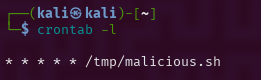
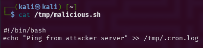
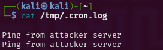
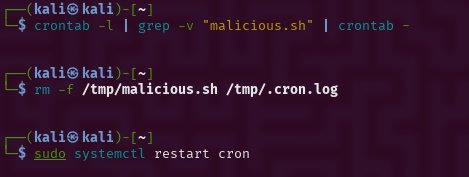

# 🛡️ Day #13 – Detecting and Removing Malicious Cron Jobs

[](https://github.com/BecomingCyber/Day13-CronJob-Lab/actions/workflows/validation.yml)


[](LICENSE)


[](https://github.com/BecomingCyber)


## 🎯 Objective
Simulate, detect, analyze, and remediate a malicious cron job on a Linux system — applying the NIST incident response lifecycle (SP 800-61 Rev. 2). The job runs a malicious script every minute from `/tmp`.

---

## 🔍 Incident Summary

| Category              | Details                                             |
|-----------------------|-----------------------------------------------------|
| **Threat Type**       | Persistence via Cron Job                            |
| **Script Path**       | `/tmp/malicious.sh`                                 |
| **Cron Schedule**     | `* * * * * /tmp/malicious.sh` (every minute)        |
| **Observed Behavior** | Echoed message to `/tmp/.cron.log`                  |
| **Initial Detection** | Discovered via `crontab -l` and `/var/log/syslog`  |
| **Response Actions**  | Crontab cleaned, script deleted, cron restarted     |

---

## 📁 File Overview

| File/Folder              | Purpose |
|--------------------------|---------|
| `scripts/malicious.sh`   | Fake script to simulate attack |
| `logs/.cron.log`         | Output written by the malicious cron job |
| `images/`              | Screenshots of detection, execution, and cleanup |
| `analysis/cron_findings.txt` | CLI investigation notes |
| `cleanup/cleanup_commands.txt` | All terminal commands used during response |

---

## 🧪 Lab Procedure

### Step 1: Simulate Malicious Cron Job
```bash
echo -e '#!/bin/bash\necho "Ping from attacker server" >> /tmp/.cron.log' > /tmp/malicious.sh
chmod +x /tmp/malicious.sh
(crontab -l; echo "* * * * * /tmp/malicious.sh") | crontab -
```
### Step 2: Detect Cron Activity
```bash
crontab -l
grep -r "/tmp/" /etc/cron* /var/spool/cron/crontabs
cat /tmp/.cron.log
cat /tmp/malicious.sh
```
Step 3: Remove and Recover
```bash
crontab -l | grep -v "malicious.sh" | crontab -
rm -f /tmp/malicious.sh /tmp/.cron.log
sudo systemctl restart cron
```

---

## 🧠 Lessons Learned
- Cron jobs can be abused for stealthy persistence.

- Critical to monitor /var/spool/cron and /etc/cron* directories.

- Logs like /var/log/syslog are useful for tracing execution.

- Cron job integrity monitoring should be implemented.

---

## ✅ Recommendations
- ✅ Restrict cron access to authorized users (/etc/cron.allow)

- ✅ Set up auditd or inotify for real-time monitoring of cron files

- ✅ Schedule periodic checks of user crontabs and /tmp for rogue scripts

---

### 📸 Screenshots

| Description              | Screenshot                                   |
|--------------------------|----------------------------------------------|
| 🧿 Malicious Job in Crontab |  |
| 📜 Contents of Script       |    |
| 📂 Log File with Output     |     |
| ✅ Cleaned Crontab          |  |

---

# 🤖 Automated Evidence Validation

This project includes a Python-based evidence validation system that automatically verifies the completeness and consistency of the incident response artifacts.

The validator checks:

- Required investigation files exist
- Cron analysis documentation is present
- Cleanup documentation is available
- Log evidence is included
- Screenshots supporting the investigation exist
- Required investigation findings are documented

Example validation output:

```text
[PASS] Investigation contains: cron
[PASS] Investigation contains: detection
[PASS] Investigation contains: cleanup
[PASS] Investigation contains: verification

[PASS] cron analysis exists.
[PASS] cleanup documentation exists.
[PASS] cron log evidence exists.
[PASS] screenshot evidence exists.
```
```text
Evidence validation completed successfully.
```

---

# 🧪 Automated Unit Testing

The project includes a Python `unittest` suite to verify evidence validation functionality.

Tests include:

- ✅ Required evidence validation
- ✅ Missing evidence rejection
- ✅ Investigation findings validation

Run tests with:

```bash
python -m unittest discover -s tests -p "test_*.py" -v
```

Current results:

```text
Ran 3 tests in 0.001s

OK
```

---

# ⚙️ Continuous Integration

Workflow file:

```text
.github/workflows/validation.yml
```

GitHub Actions provides automated validation for this incident response project.

The workflow automatically runs:

1. Python evidence validation
2. Automated unit tests

Triggered by:

- Pushes to `main`
- Pull requests targeting `main`

This ensures investigation artifacts remain complete, consistent, and ready for review.

---

# 📊 Analyst Workflow Enhancement

This project extends a traditional Linux incident response investigation by adding security automation.

The workflow demonstrates:

- Detect suspicious persistence mechanisms
- Preserve investigation artifacts
- Validate evidence integrity
- Automate quality checks
- Document findings using a SOC analyst workflow

---

# ✅ Project Checklist

- [x] Linux cron persistence investigation
- [x] Malicious cron job detection
- [x] Evidence collection and documentation
- [x] Cleanup and verification process
- [x] Python evidence validation script
- [x] Automated unit tests
- [x] GitHub Actions CI workflow
- [x] 3 automated tests passing

---

## 🏁 Status: ✅ Completed
- ✔ Simulated malicious cron job
- ✔ Detected and analyzed script behavior
- ✔ Cleaned system and validated recovery
- ✔ Documented incident with evidence

---

📜 License
This project is licensed under the [MIT License](https://github.com/BecomingCyber/Day13-CronJob-Lab.git).
