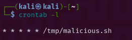
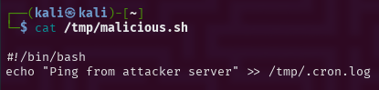
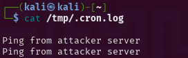
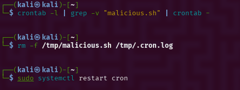

# 🛡️ Day #13 – Detecting and Removing Malicious Cron Jobs


## 🎯 Objective
Simulate, detect, analyze, and remediate a malicious cron job on a Linux system — applying the NIST incident response lifecycle (SP 800-61 Rev. 2). The job runs a malicious script every minute from `/tmp`.

---

## 🔍 Incident Summary

| Category              | Details                                             |
|-----------------------|-----------------------------------------------------|
| **Threat Type**       | Persistence via Cron Job                            |
| **Script Path**       | `/tmp/malicious.sh`                                 |
| **Cron Schedule**     | `* * * * * /tmp/malicious.sh` (every minute)        |
| **Observed Behavior** | Echoed message to `/tmp/.cron.log`                  |
| **Initial Detection** | Discovered via `crontab -l` and `/var/log/syslog`  |
| **Response Actions**  | Crontab cleaned, script deleted, cron restarted     |

---

## 📁 File Overview

| File/Folder              | Purpose |
|--------------------------|---------|
| `scripts/malicious.sh`   | Fake script to simulate attack |
| `logs/.cron.log`         | Output written by the malicious cron job |
| `images/`              | Screenshots of detection, execution, and cleanup |
| `analysis/cron_findings.txt` | CLI investigation notes |
| `cleanup/cleanup_commands.txt` | All terminal commands used during response |

---

## 🧪 Lab Procedure

### Step 1: Simulate Malicious Cron Job
```bash
echo -e '#!/bin/bash\necho "Ping from attacker server" >> /tmp/.cron.log' > /tmp/malicious.sh
chmod +x /tmp/malicious.sh
(crontab -l; echo "* * * * * /tmp/malicious.sh") | crontab -
```
### Step 2: Detect Cron Activity
```bash
crontab -l
grep -r "/tmp/" /etc/cron* /var/spool/cron/crontabs
cat /tmp/.cron.log
cat /tmp/malicious.sh
```
Step 3: Remove and Recover
```bash
crontab -l | grep -v "malicious.sh" | crontab -
rm -f /tmp/malicious.sh /tmp/.cron.log
sudo systemctl restart cron
```

## 🧠 Lessons Learned
- Cron jobs can be abused for stealthy persistence.

- Critical to monitor /var/spool/cron and /etc/cron* directories.

- Logs like /var/log/syslog are useful for tracing execution.

- Cron job integrity monitoring should be implemented.

## ✅ Recommendations
- ✅ Restrict cron access to authorized users (/etc/cron.allow)

- ✅ Set up auditd or inotify for real-time monitoring of cron files

- ✅ Schedule periodic checks of user crontabs and /tmp for rogue scripts

### 📸 Screenshots

| Description              | Screenshot                                   |
|--------------------------|----------------------------------------------|
| 🧿 Malicious Job in Crontab |  |
| 📜 Contents of Script       |    |
| 📂 Log File with Output     |     |
| ✅ Cleaned Crontab          |  |

## 🏁 Status: ✅ Completed
- ✔ Simulated malicious cron job
- ✔ Detected and analyzed script behavior
- ✔ Cleaned system and validated recovery
- ✔ Documented incident with evidence
